# Turn Pattern Sustainability Modeler

This project models whether a weekly flying turn pattern is sustainable for a given PAI, UTE target, sortie requirement, maintenance break rate, ground-abort rate, and repair profile. It keeps the spreadsheet-style logic, but runs it repeatedly through Monte Carlo iterations so the output is a probability of success rather than a single deterministic answer.

## Model Inputs

- `PAA` / `PAI`: possessed aircraft inputs. The current calculations use `PAI`.
- Historical MC rate: calculates starting `Total MC Aircraft`, rounded down because partial aircraft are not usable capacity.
- Historical ground abort rate: calculates total weekly ground aborts from total weekly sorties.
- Historical break rate: calculates total weekly Code 3 events from total weekly sorties.
- Historical 8-hour, 12-hour, and 24-hour fix rates: determine whether each GA/Code 3 event is fixed.
- TTP commit rate: caps daily committed aircraft as a percentage of `PAI`.
- AFI spare rate: calculates spares from first-go aircraft unless a day explicitly provides spares.
- GA recovery model: `Scheduled-Spares Only` allows only scheduled spares to cover ground aborts. `Fleet-Flex Recovery` also allows excess uncommitted MC aircraft to cover ground aborts.
- Daily first/second-go schedule. The current platform configuration generates first-go front lines and second-go turn lines only.
- Total required sorties. Candidate patterns may plan more sorties than required; that difference is reported as planned attrition allowance.
- Optional attrition planning rate or count. If a required sortie value is not entered, the model can calculate required sorties from planned sorties minus a floored attrition allowance.

## Core Simulation Flow

1. Planned weekly sorties are calculated from the Monday-Friday pattern.
2. Required sorties are user-entered when available. If no requirement is entered, the optional attrition planning allowance can calculate `required sorties = planned sorties - floor(planned sorties x attrition rate)` or `planned sorties - attrition count`.
3. Code 3 and ground-abort counts are generated using either the Normal TTP method or the Probabilistic Monte Carlo method.
4. Code 3 and ground-abort events are randomly distributed across Monday-Friday.
5. Daily event counts cannot exceed that day's first-go aircraft.
6. Starting MC aircraft are `floor(PAI * historical MC rate)`.
7. Daily MC aircraft for flying are the prior day's `Available EOD`.
8. Each GA/Code 3 event flows through 8-hour, 12-hour, and 24-hour fix logic using the selected fix-count method.
9. 12-hour and 24-hour fixes do not start until Tuesday. Unfixed Monday events carry into Tuesday for those longer fix attempts.
10. Scheduled spares absorb ground aborts before planned sorties are counted as lost.
11. In `Scheduled-Spares Only`, only scheduled spares cover ground aborts. In `Fleet-Flex Recovery`, uncommitted MC aircraft can also cover ground aborts.
12. `Available EOD = MC aircraft for flying - GA - Code 3 + fixed events`.
13. Saturday, Sunday, and next Monday continue the same carry-forward logic with no scheduled flying unless a schedule is provided.
14. A sortie requirement is met when actual flown sorties are greater than or equal to required weekly sorties. Planned attrition is reported separately.

## Model Layers

The model is organized as a pipeline. Each layer has a different job, which keeps the Monte Carlo logic deep while making the report easier to interpret.

### TTP / Policy Layer

The policy layer holds the operational assumptions that shape the rest of the model.

The policy defaults live in `ttp_rules.py` as `TtpPolicy`. Changing that policy lets you adjust TTP assumptions without editing the Monte Carlo mechanics.

It defines:

- TTP commit rate, currently 55%.
- UTE planning points, currently 0.40, 0.45, 0.50, and 0.52.
- Spare calculation policy.
- Recovery model:
  - `Scheduled-Spares Only`: only scheduled spares cover ground aborts.
  - `Fleet-Flex Recovery`: scheduled spares plus uncommitted MC aircraft can cover ground aborts.
- First-go / second-go pattern limits for this platform.
- Monday exclusion of 12-hour and 24-hour fixes.
- Human-factor preferences such as front-week execution, waterfall/flat patterns, and Friday recovery.
- Max-commit surge posture.

The policy layer should answer: “What rules are we applying?”

### Capacity Sweep

The capacity sweep estimates sortie production by fleet size before turn-pattern details are tested.

For each PAI from 1 to 15, it calculates:

- Weekly sorties at each UTE planning point.
- 55% commit aircraft.
- Max-commit weekly sortie capacity.
- Max-commit UTE.

This layer does not choose a daily pattern. It answers: “At this PAI, what sortie level is even in-bounds?”

### Pattern Generator

The pattern generator builds Monday-Friday candidate schedules that match a weekly sortie count.

It:

- Generates daily sortie flows.
- Tests first-go / second-go splits.
- Keeps sortie output separate from front-line aircraft demand.
- Enforces TTP commit limits.
- Applies daily cap and day-to-day smoothing constraints.
- Classifies patterns as flat, waterfall, front-loaded, recovery valley, sawtooth, compressed surge, and related families.

This layer answers: “What realistic turn patterns could produce this sortie count?”

### Input Validation

The validation layer checks assumptions before they are used for decision support.

It flags:

- Rates outside 0-1.
- Required sorties that exceed planned sorties.
- Fix-rate sequencing issues, such as a 24-hour fix rate lower than the 12-hour rate.
- Scheduled aircraft above the TTP commit cap.
- No-spare Scheduled-Spares Only cases.
- Low iteration counts or unusually high planned attrition assumptions.

This layer answers: “Are the inputs reasonable enough to brief?”

### Simulation Engine / Monte Carlo

The simulation engine is the heart of the model. It takes a candidate pattern and runs repeated iterations through the maintenance and recovery logic.

Each iteration:

- Generates weekly GA and Code 3 events.
- Randomly distributes those events across flying days.
- Applies the selected recovery model to ground abort coverage.
- Applies 8-hour, 12-hour, and 24-hour fix logic.
- Carries unfixed events into the repair backlog.
- Carries available aircraft from each day into the next day.
- Runs weekend and next-Monday recovery.
- Scores success and failure dimensions.

This layer answers: “If this pattern is flown many times under these assumptions, how often does it work?”

### Optimizer

The optimizer ranks simulated patterns.

It favors:

- High overall operational success.
- Required sortie success.
- Aircraft availability.
- TTP commit compliance.
- Next-Monday recovery.
- Low repair backlog.
- Smooth daily flow.
- Front-week execution.
- Friday recovery.
- Familiar flat and waterfall shapes.

It intentionally does not treat max-commit surge as a normal best-fit candidate.

This layer answers: “Of the patterns that can be flown, which one is the best fit?”

### Recommendation Engine

The recommendation engine converts model rows into operational language.

It separates:

- Feasible: fits UTE, commit cap, sortie requirement, and go-structure constraints.
- Executable: has enough probability of making the week.
- Sustainable: can make the week and recover enough aircraft/backlog to repeat.

It also assigns:

- Operational assessment.
- Confidence level.
- Primary limiting factor.
- Plain-English recommendation.
- Baseline-vs-candidate deltas for future GUI comparison views.

This layer answers: “What should we fly, why, and what is the risk?”

### Surge Model

The surge model is separate from normal sustainment analysis.

It uses the 55% max-commit posture and carries stress across multiple weeks:

- Ending MC aircraft carries forward.
- Repair backlog carries forward.
- Surge debt accumulates.
- Event pressure increases over time.
- Fix effectiveness degrades over time.

This layer answers: “How long can max commit be sustained before risk becomes unacceptable?”

### Reports

The reports translate the model output into leadership-readable views.

The integrated report emphasizes:

- Capacity by PAI and UTE.
- Best-fit planning patterns.
- Recovery model comparison.
- Failure mode attribution.
- Pattern family discovery.
- Surge duration.
- Hidden diagnostic tables for deeper review.

The integrated report includes the capacity view, pattern optimization, recovery model comparison, and surge analysis in one product.

```mermaid
flowchart TD
    A["Model Inputs"] --> A1["Fleet: PAA, PAI, flying days"]
    A --> A2["Maintenance rates: MC, ground abort, Code 3/break"]
    A --> A3["Repair rates: 8-hour, 12-hour, 24-hour fix"]
    A --> A4["Operational policy inputs: TTP commit %, spare %, GA recovery model"]
    A --> A5["Planning rules: UTE targets, planned attrition %, required sorties"]
    A4 --> P["TTP / Policy Layer"]
    P --> P1["Commit cap, spare rule, recovery model"]
    P --> P2["Allowed go structure and pattern constraints"]
    P --> P3["Long-fix timing rule: 12/24-hour fixes start Tuesday"]
    P --> P4["Human-factor scoring: front-week execution and Friday recovery"]
    P --> P5["Surge posture: 55% max-commit stress case"]

    A1 --> B["Capacity Sweep"]
    A5 --> B
    P --> B
    B --> B1["For each PAI, calculate weekly sorties at 0.40, 0.45, 0.50, 0.52 UTE and round down to stay within the UTE target"]
    B --> B2["For surge only, calculate max commit aircraft = floor(PAI x 55%)"]
    B2 --> B3["Max surge sorties = commit aircraft x flying days"]

    B1 --> C["Turn Pattern Generation"]
    P --> C
    C --> C1["Generate Monday-Friday daily sortie totals matching weekly sortie requirement"]
    C1 --> C2["Generate valid first/second-go splits for each day"]
    C2 --> C3["Apply platform limits: first/second-go only, daily cap, day-to-day delta, no unrealistic spikes"]
    C3 --> C4["Apply TTP policy: aircraft required = first-go + spares must stay within commit cap"]
    C4 --> C5["Classify pattern family: flat, waterfall, front-loaded, recovery valley, compressed surge, etc."]
    C5 --> C6["Score human-factor shape: front-week execution, flat/waterfall preference, Friday recovery, normal turn usage"]

    C6 --> D["Simulation Engine / Monte Carlo For Each Candidate Pattern"]
    P --> D
    D --> D1["Set planned sorties = sum of Mon-Fri daily sorties"]
    D1 --> D2{"Required sorties entered?"}
    D2 --> D3["Yes: use entered required weekly sorties"]
    D2 --> D4["No: optionally calculate required sorties from floored planned attrition allowance"]
    D3 --> D5["Start each iteration with Total MC = floor(PAI x MC rate)"]
    D4 --> D5
    D5 --> D6["Set MC aircraft for Monday flying = Total MC"]

    D6 --> E["Weekly Event Generation"]
    E --> E1{"Event-count method"}
    E1 --> E2["Normal TTP: ceil(weekly sorties x event rate) so fractional failures are not hidden"]
    E1 --> E3["Probabilistic Monte Carlo: each sortie receives event chance"]
    E2 --> E4["Generate weekly Code 3 total and weekly GA total"]
    E3 --> E4
    E4 --> E5["Randomly distribute Code 3 and GA across Mon-Fri"]
    E5 --> E6["Daily event totals constrained by daily front-line aircraft"]

    E6 --> F["Daily Execution Loop"]
    F --> F1["Read daily schedule: first go, second go, spares"]
    F1 --> F2["Aircraft required = first-go + spares"]
    F2 --> F3["Check aircraft availability: MC for flying >= aircraft required"]
    F3 --> F4["Check TTP compliance: aircraft required <= commit limit"]
    F4 --> F5["Apply daily Code 3 + GA events"]

    F5 --> G["Ground Abort Coverage"]
    P --> G
    G --> G1["Scheduled spares available = min(spares, MC for flying - first-go)"]
    G1 --> G2{"GA recovery mode"}
    G2 --> G3["Scheduled-Spares Only: scheduled spares cover GAs"]
    G2 --> G4["Fleet-Flex Recovery: scheduled spares plus uncommitted MC aircraft cover GAs"]
    G3 --> G5["Uncovered GAs become lost sorties"]
    G4 --> G5
    G5 --> G6["Sorties flown = planned daily sorties - lost sorties"]

    F5 --> H["Fix Logic"]
    P --> H
    H --> H1{"Fix-count method"}
    H1 --> H2["Normal TTP: expected-value rounding for fixes; probabilistic mode handles event-level repair chance"]
    H1 --> H3["Probabilistic Monte Carlo: each event receives fix chance"]
    H2 --> H4["8-hour fixes may return same day"]
    H3 --> H4
    H4 --> H5["Monday cannot use 12/24-hour fixes; remaining events enter long-fix queue"]
    H5 --> H6["Tuesday-Sunday: 12-hour then 24-hour fixes process long-fix queue plus new remaining events"]
    H6 --> H7["Unfixed events carry forward as repair backlog"]

    G6 --> I["Daily MC Carry-Forward"]
    H7 --> I
    I --> I1["Available EOD = MC for flying - GA - Code 3 + total fixes"]
    I1 --> I2["Next day's MC for flying = prior day's Available EOD"]
    I2 --> I3["Repeat through Friday, Saturday, Sunday, and Next Monday"]

    I3 --> J["Iteration Scoring"]
    P --> J
    J --> J1["Actual attrition = planned sorties - sorties flown"]
    J1 --> J2["Required sortie success = actual flown sorties >= required weekly sorties"]
    J2 --> J3["Aircraft success = required aircraft were available each flying day"]
    J3 --> J4["Commit success = aircraft required stayed within TTP cap each flying day"]
    J4 --> J5["Recovery success = next-Monday aircraft meet the required threshold"]
    J5 --> J6["Backlog success = open repair queue stays within threshold and no events were suppressed"]
    J6 --> J7["Overall success = required sorties + daily schedule + aircraft + commit + recovery + backlog + no suppressed events"]
    J7 --> J8["Record failure day and failure mode: full schedule, sortie shortfall, daily miss, aircraft availability, TTP commit, recovery, repair backlog"]
    J8 --> J9["Record recovery state: next-Monday MC and recovery debt"]

    J9 --> K["Aggregate All Iterations"]
    K --> K1["Average success probability"]
    K --> K2["Success standard deviation and observed range"]
    K --> K3["Average actual attrition"]
    K --> K4["Average next-Monday available aircraft"]
    K --> K5["Failure counts and failure-mode attribution"]

    K5 --> L["Pattern Optimization"]
    P --> L
    L --> L1["Composite score favors high average success, sortie success, aircraft success, commit compliance"]
    L1 --> L2["Score also favors next-Monday recovery, low repair debt, smooth patterns, and human-factor flat/waterfall shapes"]
    L2 --> L3["Rank best pattern by PAI, UTE, attrition scenario, recovery model, event method, and fix method"]
    L3 --> L4["Group discovery outputs by pattern family and unique daily flow"]

    B3 --> S["Surge Duration Model"]
    P --> S
    S --> S1["Force true max-commit front-line schedule: commit aircraft x flying days"]
    S1 --> S2["Run week 1 with normal MC start"]
    S2 --> S3["Carry ending MC, repair backlog, and surge debt into next week"]
    S3 --> S4["Each surge week increases event pressure and reduces fix effectiveness"]
    S4 --> S5["Stop interpretation when success falls below threshold or commit capacity cannot be maintained"]

    L4 --> M["Reports"]
    S5 --> M
    M --> M1["UTE capacity tables by PAI"]
    M --> M2["Best-fit pattern table with average success, SD, range, recovery, risk, and failure mode"]
    M --> M3["Pattern family comparison and discovery tables"]
    M --> M4["Recovery model and Normal TTP vs probabilistic comparisons"]
    M --> M5["Surge duration table with success, commit capacity, backlog, and surge debt"]
```



## Turn Pattern Generation

The optimizer separates sortie output from front-line aircraft demand.

- A daily sortie total can be flown with multiple first/second-go splits.
- For this platform, generated patterns use first-go and second-go only.
- Example: a 7-sortie day can be tested as `4 first-go + 3 second-go`, `5 first-go + 2 second-go`, or `6 first-go + 1 second-go` when the TTP commit cap allows it.
- Pattern displays use `total sorties(front-line aircraft)`, so `7(5)` means 7 total sorties with 5 front-line aircraft.
- The generator preserves unique daily flows and unique first/second-go splits. It no longer assumes sorties must equal front-line aircraft.

## Success Metrics

The simulator reports:

- Average probability of overall success across Monte Carlo iterations.
- Standard deviation of the iteration-level success result.
- Observed success range for the iteration set.
- P10, P50, P90, and a 95% confidence interval for success.
- Full planned schedule success, separate from required sortie success.
- Probability of meeting total required sorties.
- Probability of meeting each day of the planned schedule.
- Probability actual attrition stays within planned attrition.
- Probability of having all required aircraft available each flying day.
- Probability of staying within the TTP commit rate.
- Probability of next-Monday recovery success.
- Probability of staying within repair backlog limits.
- Probability no events were suppressed by distribution constraints.
- Average next-Monday available aircraft.
- Average repair backlog, actual attrition percentage, planned attrition percentage, and attrition delta.
- Count of the first failure point by day.

Use `compare_turn_patterns()` to pass multiple named `Scenario` objects and receive one summary for each turn pattern.

## Validation Safeguards

The model now prevents a pattern from looking successful solely because attrition assumptions were favorable.

- Overall success requires required sortie success, daily schedule success, aircraft availability, TTP commit compliance, next-Monday recovery, repair backlog control, and no suppressed events.
- Required sortie success is requirement-based: actual flown sorties must be greater than or equal to required weekly sorties.
- Planned attrition is optional and tracked separately from success. It reports planned attrition allowance, actual attrition count, actual attrition percentage, and attrition delta.
- A week can meet required sorties while still failing full operational success because of daily schedule misses, aircraft availability, commit compliance, recovery, backlog, or suppressed events.
- Daily misses are tracked by day, including first failed day, worst failed day, and failed-day count.
- Next-Monday recovery is validated against the required aircraft threshold, and recovery debt is reported.
- Repair backlog is a hard failure when it exceeds the configured threshold.
- Event overflow is not silently discarded. Overflow is redistributed until daily front-line capacity is exhausted; any remaining overflow is counted as suppressed events and marks the result statistically constrained.
- Repair logic prevents fixes from exceeding open events, clamps fix rates to valid bounds, and carries unfixed events forward instead of clearing the queue.
- Aircraft EOD is clamped between zero and PAI. Warnings are recorded if the unclamped value exceeds those bounds.
- Optional repeat-recur logic can increase next-day Code 3 risk for recently repaired aircraft through `repeat_recur_multiplier`.
- Optional fatigue fields can increase break pressure or degrade fix effectiveness during stressed cases.
- Optional repair capacity fields can limit daily repair throughput and reduce weekend repair capacity, causing backlog to grow when repair demand exceeds capacity.
- Low-confidence outputs are flagged when iteration count is low, variance is high, confidence intervals are wide, event suppression occurs, or backlog remains open.

## Rounding Rules

The model separates aircraft-capacity rounding from statistical-rate rounding.

- Aircraft capacity is rounded down: MC aircraft, TTP commit aircraft, calculated spares, repair throughput capacity, UTE sortie capacity, and optional planned attrition allowance.
- Deterministic Normal TTP bad-event counts round up when a fractional GA or Code 3 total exists, so fractional failures are not hidden.
- Deterministic Normal TTP fixes use expected-value rounding because a fix rate is a repair probability approximation, not a physical aircraft allocation. For true event-by-event repair behavior, use the Probabilistic Monte Carlo fix model.
- Probabilistic Monte Carlo event and fix modes do not round expected values. They roll each sortie or repair event individually.

## Run The Example

```bash
python3 example_run.py
```

The example now runs multiple named turn patterns in two models and prints:

- A `Scheduled-Spares Only` comparison table where only scheduled spares cover ground aborts.
- A `Fleet-Flex Recovery` comparison table where uncommitted MC aircraft can also cover ground aborts.
- A detailed result section and sample Monte Carlo week for each pattern in each model.

Add or edit patterns in `example_run.py` inside the `turn_pattern_inputs` dictionary:

```python
"Pattern Name": {
    "schedule": {
        "Mon": DaySchedule(first_go=4, second_go=1),
        "Tue": DaySchedule(first_go=4, second_go=1),
        "Wed": DaySchedule(first_go=4, second_go=1),
        "Thu": DaySchedule(first_go=4, second_go=1),
        "Fri": DaySchedule(first_go=4, second_go=1),
    },
    "total_required_sorties": 25,
}
```

The example values are based on the visible spreadsheet structure and should be adjusted once the exact workbook formulas are confirmed.

## Generate Analysis Charts

To rebuild the HTML report:

```bash
python3 analysis_report.py
```

This creates `analysis_output/report.html` with the optimization workflow:

- A dedicated `TtpPolicy` layer in `ttp_rules.py` controlling commit rate, UTE levels, flying days, spares, go limits, long-fix timing, recovery model names, surge posture, human-factor weights, and risk thresholds.
- Input validation for out-of-range assumptions, suspicious fix-rate sequencing, commit-cap violations, low iteration counts, and unusually high attrition assumptions.
- Recommendation fields that label each row as feasible, executable, sustainable, or not recommended, with a limiting factor and confidence level.
- Scenario run metadata support for timestamp, model version, policy version, seed, iterations, recovery model, event/fix mode, and input fingerprint.
- Capacity sweep by PAI for 0.40, 0.45, 0.50, 0.52 UTE, and 55% max-commit surge.
- Generated Monday-Friday turn-pattern permutations that preserve unique daily flows and unique first/second-go splits.
- Planned sorties scale by PAI and UTE. Required sortie success is based on actual flown sorties versus the required weekly target; optional attrition buffers calculate a planning requirement only when a direct required sortie target is not entered.
- Automatic pattern family/name classification, such as Flat Turns, Waterfall, Recovery Valley, Sawtooth, and Compressed Surge.
- `Scheduled-Spares Only` and `Fleet-Flex Recovery` Monte Carlo results for generated patterns.
- Two event-count methods:
  - Normal TTP: weekly GA and Code 3 totals are calculated as `ceil(weekly sorties * rate)`, then randomly spread across the week.
  - Probabilistic Monte Carlo: every planned sortie gets its own random GA and Code 3 chance, so weekly event totals vary by iteration.
- Two fix-count methods:
  - Normal TTP: fixed aircraft are calculated using expected-value rounding at each 8-hour, 12-hour, and 24-hour step.
  - Probabilistic Monte Carlo: each event gets its own random fix chance at each step, so repair outcomes vary by iteration.
- Planned sorties, required sorties, planned attrition buffer, and actual attrition.
- Best-fit pattern by PAI, UTE point, weekly sortie requirement, and model type. Pattern tables show average success, success standard deviation, and observed success range rather than treating `100%` as the only useful endpoint.
- Human-factor preference in best-fit scoring: the optimizer favors flat and waterfall schedules that execute more of the work early, keep Friday reduced when possible, and avoid relying on weekend duty to recover the fleet.
- First/second-go preference: when several schedules have similar success, the model favors familiar two-go shapes such as `6(4)` flat turns and waterfall flows like `7(5)-6(4)-6(4)-5(3)-3(3)`, where the number in parentheses is the first-go/front-line aircraft count.
- Backend-load preference: Thursday/Friday-heavy patterns are still allowed when required by sortie demand, but they are no longer preferred solely because the weekend creates extra repair time before Monday.
- Moderate turn usage is favored over extreme turn usage. The optimizer tests all valid first/second-go splits, but the composite score avoids automatically picking the lowest possible front-line count when that creates an unrealistic turn-heavy day.
- Best sustainable UTE by PAI.
- Recovery model comparison.
- Pattern family comparison, pattern discovery tables, recovery debt, and failure attribution.
- Multi-week surge duration using carry-forward MC, repair backlog, and surge debt behavior.
- Surge modeling is intentionally harsher than normal sustainment: max-commit weeks accumulate deferred-maintenance debt, event pressure increases by week, and fix effectiveness degrades by week. This keeps 55% commit analysis closer to a 1-2 week surge question instead of treating it like a normal sustainable rhythm.
- The surge section forces the max-commit front-line schedule directly, such as `commit aircraft x 5 flying days`. It does not use second-go turns to make max sortie output look less stressful than an actual 55% commit posture.
- An in-report PAI dropdown that filters tables after the simulation has run.
- Additional report filters for attrition scenario, recovery model, UTE point, risk band, and pattern family.
- Event-count and fix-count filters for switching between Normal TTP and Probabilistic Monte Carlo outputs.
- A minimum weekly sorties required filter, so entering a value such as `24` hides patterns that plan fewer than 24 sorties.
- Pattern displays in `total sorties(front-line aircraft)` format, such as `8(6)`, so turn patterns show both output and TTP commit demand.
- Generated patterns test all valid first/second-go splits for the same daily sortie count. For example, a 7-sortie day can be evaluated as 4+3, 5+2, or 6+1 depending on the commit cap and second-go limit.

The report now evaluates requirement-based planning plus three optional planned attrition scenarios:

- Requirement Based: no planned attrition buffer.
- Low Attrition: 10%
- Planning Attrition: 15%
- High Attrition: 20%

For each generated PAI/UTE case, required sorties are either the selected required target or planned sorties minus the selected optional attrition allowance. Attrition is reported as planned allowance, actual attrition count, actual attrition percentage, and attrition delta; it is not a standalone gate for overall success.

The current report defaults are tuned for practical local runtime. The optimizer module can still run all valid generated permutations under its configured constraints. Increase `REPORT_ITERATIONS`, remove `max_patterns_per_requirement`, or loosen `PatternConstraints` in `analysis_report.py` when you want a deeper overnight-style search.

## Run The Streamlit GUI

Install the GUI dependency once:

```bash
python3 -m pip install -r requirements.txt
```

Then launch the dashboard:

```bash
streamlit run gui_app.py
```

The GUI is intentionally a thin layer over the model. It collects inputs, builds an `OptimizationConfig`, runs the optimizer/surge model, and displays:

- Executive recommendation.
- Capacity sweep.
- Ranked best patterns.
- Pattern detail table.
- Max-commit surge duration.
- Validation warnings and run metadata.

The GUI does not contain model math. Core logic remains in the policy, simulation, optimizer, surge, validation, and recommendation modules.

UTE is calculated as `weekly sorties / (PAI * flying days)`. The default flying-day count is 5, but the optimizer accepts a configurable `flying_days` value.

## Optimization Modules

Required model files are intentionally limited and separated by job:

- `simulation_engine.py`: explicit Monte Carlo simulation interface used by the optimizer and reports.
- `turn_pattern_modeler.py`: backward-compatible implementation file for the simulation engine.
- `model_config.py`: shared baseline assumptions used by the demo and optimizer.
- `pattern_generator.py`: turn-pattern permutation generation and pattern classification.
- `optimizer.py`: Monte Carlo scoring, ranking, recovery-model comparison, and best-fit selection.
- `surge_model.py`: multi-week surge duration with carry-forward MC, repair backlog, event/fix degradation, and accumulated surge debt.
- `analysis_report.py`: integrated optimization report.
- `report_utils.py`: shared HTML report formatting helpers.

Convenience and demonstration files:

- `example_run.py`: named turn-pattern examples and console comparison workflow.
- `test_model_validations.py`: validation and regression tests.

Generated HTML files live in `analysis_output/` and can be recreated by rerunning the report scripts.
