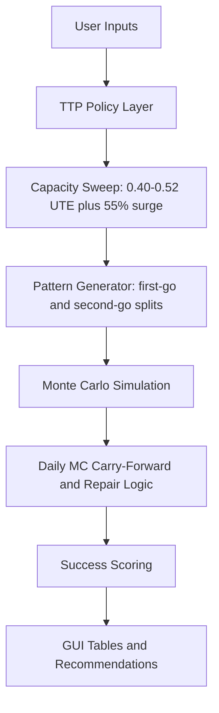

# Turn Pattern Sustainability Monte Carlo Model

This is a condensed Streamlit Monte Carlo model for assessing whether weekly turn patterns are sustainable under TTP commit limits, UTE planning bands, maintenance event rates, and repair assumptions.

## Files

- `ttp_rules.py`: TTP/policy assumptions, model version, validation, risk bands, commit-rate math, spare rules, and recovery model names.
- `simulation.py`: simulation and Monte Carlo mechanics: event generation, event distribution, GA coverage, fix logic, daily MC carry-forward, weekend recovery, and success scoring.
- `pattern_generator.py`: UTE capacity sweep, deployed UTE calculator, turn-pattern permutations, first-go/second-go splits, and pattern classification.
- `gui_app.py`: Streamlit interface for optimization, manual pattern testing, and deployed UTE calculation.
- `MODEL_LOGIC.md`: deeper reference explaining each model phase, feature, and output interpretation.
- `requirements.txt`: Python package requirements.

Generated output may appear in `analysis_output/`; it is not required to run the GUI.

## Run

```bash
python3 -m venv .venv
source .venv/bin/activate
pip install -r requirements.txt
streamlit run gui_app.py
```

## GUI Pages

### Optimization Dashboard

Runs generated Monday-Friday first-go/second-go turn patterns through the Monte Carlo simulation.

The UTE sweep always includes every target from `0.40` through `0.52`, plus a separate `55% Commit Surge` capacity point. Weekly sortie counts round down because partial aircraft/sorties are not usable planning capacity, so adjacent UTE targets may produce the same sortie count at smaller PAI.

Outputs include:

- Capacity sweep by PAI and UTE target.
- Best pattern per PAI, UTE point, and recovery model.
- Success probability.
- Sortie success probability.
- Aircraft availability and commit compliance.
- Next-Monday MC recovery.
- Risk band.

### Manual Turn Pattern

Lets you enter a specific first-go/second-go split, such as:

```text
5x2, 4x2, 4x2, 3x2, 2x0
```

The page runs that pattern against both recovery models:

- `Scheduled-Spares Only`
- `Fleet-Flex Recovery`

### DSUTE Calculator

Calculates location DSUTE on the sortie side only. Flying hours, average sortie duration, and deployed or operating-location flying hours are not used.

Inputs:

- Scheduled or required sorties.
- Possessed aircraft.
- O&M days.
- Optional deployed or operating-location sorties only when intentionally toggled into the requirement.

Calculations:

- `DSUTE = scheduled or required sorties / (possessed aircraft x O&M days)`

Example:

- `31 / (11 x 7) = 0.40 DSUTE`
- `32 / (11 x 7) = 0.42 DSUTE`
- `40 / (11 x 7) = 0.52 DSUTE`

### About / Model Logic

Provides the README-level explanation inside the web app, including model purpose,
logic flow, success rules, recovery models, DSUTE logic, and tab interpretation.
The deeper standalone reference is available in `MODEL_LOGIC.md`.

## Model Flow



## Core Logic

1. Planned weekly sorties come from the Monday-Friday schedule.
2. Required sorties are entered by the user.
3. Code 3 and ground-abort events are generated from weekly sortie totals.
4. Events are distributed across flying days without silently discarding overflow.
5. Starting MC aircraft are `floor(PAI x MC rate)`.
6. Daily MC aircraft carry forward from the previous day’s ending availability.
7. Ground aborts may be covered by scheduled spares or by uncommitted MC aircraft, depending on recovery model.
8. Fixes are applied through 8-hour, 12-hour, and 24-hour logic.
9. 12-hour and 24-hour fixes begin on Tuesday by default.
10. Saturday, Sunday, and next Monday continue recovery logic.
11. Success requires more than sortie count alone: required sorties, daily schedule, aircraft availability, commit compliance, recovery, backlog, and event integrity all matter.

## Version

Current model version: `0.22.7`

Version `0.3` adds a configurable UTE planning range, PAI-specific decision briefs,
sustainable-only best-pattern output, cleaner DSUTE wording, and updated GUI defaults.

Version `0.4` adds embedded comparison views: best sustainable pattern by UTE
and selected-pattern recovery model comparison.

Version `0.5` removes organization- and location-specific wording from user-facing
documentation and helper naming.

Version `0.6` adds an About / Model Logic page to the web app.

Version `0.7` adds average sorties per aircraft to the DSUTE calculator.

Version `0.8` adds a left-to-right visual model-flow diagram to the web app.

Version `0.9` adds average sorties per aircraft to UTE-facing tables and
shows UTE in best-pattern outputs.

Version `0.10` enlarges the in-app model-flow diagram for readability.

Version `0.11` replaces the model-flow diagram with a readable stepped flow
section in the About page.

Version `0.12` adds a DSUTE-derived suggested UTE planning band for model limits.

Version `0.13` makes UTE table displays compatible with cached results from
older model versions.

Version `0.14` expands the About page with explanations for sidebar options,
maintenance rates, event/fix modes, output metrics, and tab features.

Version `0.15` adds configurable # of GOs depth for 1st through 4th go in both
optimization and manual turn-pattern testing.

Version `0.16` restores a separate max-commit surge week calculation for weeks
1-5 in the web app.

Version `0.17` adds a detailed Underlying Logic section to the About page.

Version `0.18` improves the Max Surge Weeks tab with a sustainability summary,
trend charts, and a first-failure explanation for each PAI/recovery model.

Version `0.19` changes generated turn-pattern displays to normal go notation,
such as `4x2-4x2-4x2-3x2-3x2`.

Version `0.20` adds dashboard diagnostics and charts for summary decisions,
capacity shape, pattern-family performance, failure modes, and selected-pattern
success dimensions.

Version `0.21` removes low-value dashboard charts and replaces them with clearer
diagnostic readout tables while keeping useful pressure visuals for surge weeks
and daily sortie shape.

Version `0.21.1` keeps the Summary decision brief and makes generated pattern
selection family-balanced so all discovered pattern families are represented
before Monte Carlo ranking.

Version `0.21.2` simplifies the Summary tab by removing the Decision Overview
and Operating Envelope callouts.

Version `0.21.3` separates tested candidates from recommendations. The model can
simulate operationally questionable shapes for visibility, but the recommendation
screen rejects max-commit surge, heavily back-loaded, Friday-heavy, compressed,
or highly uneven patterns from the sustainable/recommendable list.

Version `0.21.4` tightens pattern-family classification so low-variance
waterfalls like `4x2-4x2-4x2-3x2-3x2` are no longer mislabeled as flat turns.

Version `0.21.5` keeps the best simulated candidate from each discovered pattern
family instead of only the single overall winner, and lets first-go shape relabel
near-flat sortie totals as waterfall, step, front-loaded, or back-loaded patterns
when that better reflects the operational turn pattern.

Version `0.21.6` adds a sidebar scheduled-spares toggle. When enabled, scheduled
spares are modeled at 20% of first-go aircraft; when disabled, the model uses no
scheduled spares.

Version `0.21.7` makes flat-turn classification operational instead of
statistical. A pattern is only a flat turn when the same GO split repeats every
flying day, such as `4x2-4x2-4x2-4x2-4x2`.

Version `0.21.8` renames diagnostics near-miss wording from "best failed" to
"Closest Non-Recommended Pattern" and adds an explanatory callout in the
Diagnostics tab.

Version `0.21.9` tightens user-facing output language so near-miss,
non-recommended, and representative family candidates are not confused with
execution recommendations.

Version `0.21.10` prevents exact flat-turn patterns from being rejected as
Friday pushes simply because Friday ties the same first-go count used every
other flying day.

Version `0.22.0` simplifies pattern selection by using an explicit operational
family order. Normal families are preserved first, while reverse-waterfall,
back-loaded, and compressed-surge families remain visible as diagnostic-only
candidates rather than normal recommendations.

Version `0.22.1` further tightens flat-turn logic so flat daily sortie totals
are not labeled as flat turns unless the exact GO split repeats every flying day.

Version `0.22.2` changes generator ordering to favor smoother, less-compressed
patterns before Friday-recovery-heavy shapes, reducing unrealistic schedules
with very low Friday output when a normal waterfall or flat option exists.

Version `0.22.3` adds `MODEL_LOGIC.md` and expands the About page with concrete
model-flow and feature-impact tables.

Version `0.22.4` redesigns the About page into a guided walkthrough with a
clear testing sequence, model logic chain, output interpretation, and optional
deep-dive sections.

Version `0.22.5` simplifies the About page further into a quick guide with only
the core idea, logic flow, recommended workflow, interpretation rules, and three
optional detail expanders.

Version `0.22.6` changes scheduled spare calculation to round up, while keeping
commit aircraft and UTE capacity rounded down.

Version `0.22.7` renames the project and web app to Turn Pattern Sustainability
Monte Carlo Model.
