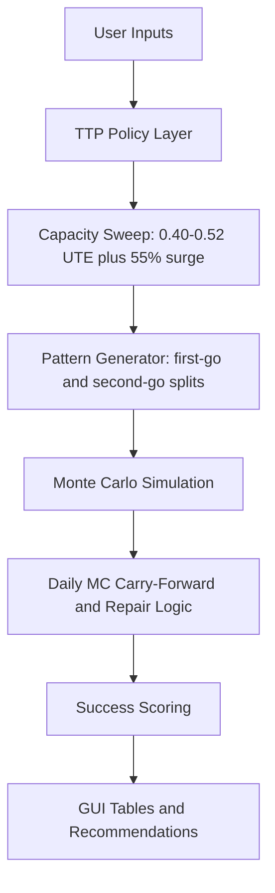

# Turn Pattern Sustainability Modeler

This is a condensed Streamlit model for assessing whether weekly turn patterns are sustainable under TTP commit limits, UTE planning bands, maintenance event rates, and repair assumptions.

## Files

- `ttp_rules.py`: TTP/policy assumptions, model version, validation, risk bands, commit-rate math, spare rules, and recovery model names.
- `simulation.py`: simulation and Monte Carlo mechanics: event generation, event distribution, GA coverage, fix logic, daily MC carry-forward, weekend recovery, and success scoring.
- `pattern_generator.py`: UTE capacity sweep, deployed UTE calculator, turn-pattern permutations, first-go/second-go splits, and pattern classification.
- `gui_app.py`: Streamlit interface for optimization, manual pattern testing, and deployed UTE calculation.
- `requirements.txt`: Python package requirements.

Generated output may appear in `analysis_output/`; it is not required to run the GUI.

## Run

```bash
python3 -m venv .venv
source .venv/bin/activate
pip install -r requirements.txt
streamlit run gui_app.py
```

## GUI Pages

### Optimization Dashboard

Runs generated Monday-Friday first-go/second-go turn patterns through the Monte Carlo simulation.

The UTE sweep always includes every target from `0.40` through `0.52`, plus a separate `55% Commit Surge` capacity point. Weekly sortie counts round down because partial aircraft/sorties are not usable planning capacity, so adjacent UTE targets may produce the same sortie count at smaller PAI.

Outputs include:

- Capacity sweep by PAI and UTE target.
- Best pattern per PAI, UTE point, and recovery model.
- Success probability.
- Sortie success probability.
- Aircraft availability and commit compliance.
- Next-Monday MC recovery.
- Risk band.

### Manual Turn Pattern

Lets you enter a specific first-go/second-go split, such as:

```text
5x2, 4x2, 4x2, 3x2, 2x0
```

The page runs that pattern against both recovery models:

- `Scheduled-Spares Only`
- `Fleet-Flex Recovery`

### DSUTE Calculator

Calculates location DSUTE on the sortie side only. Flying hours, average sortie duration, and deployed or operating-location flying hours are not used.

Inputs:

- Scheduled or required sorties.
- Possessed aircraft.
- O&M days.
- Optional deployed or operating-location sorties only when intentionally toggled into the requirement.

Calculations:

- `DSUTE = scheduled or required sorties / (possessed aircraft x O&M days)`

Example:

- `31 / (11 x 7) = 0.40 DSUTE`
- `32 / (11 x 7) = 0.42 DSUTE`
- `40 / (11 x 7) = 0.52 DSUTE`

### About / Model Logic

Provides the README-level explanation inside the web app, including model purpose,
logic flow, success rules, recovery models, DSUTE logic, and tab interpretation.

## Model Flow



## Core Logic

1. Planned weekly sorties come from the Monday-Friday schedule.
2. Required sorties are entered by the user.
3. Code 3 and ground-abort events are generated from weekly sortie totals.
4. Events are distributed across flying days without silently discarding overflow.
5. Starting MC aircraft are `floor(PAI x MC rate)`.
6. Daily MC aircraft carry forward from the previous day’s ending availability.
7. Ground aborts may be covered by scheduled spares or by uncommitted MC aircraft, depending on recovery model.
8. Fixes are applied through 8-hour, 12-hour, and 24-hour logic.
9. 12-hour and 24-hour fixes begin on Tuesday by default.
10. Saturday, Sunday, and next Monday continue recovery logic.
11. Success requires more than sortie count alone: required sorties, daily schedule, aircraft availability, commit compliance, recovery, backlog, and event integrity all matter.

## Version

Current model version: `0.17`

Version `0.3` adds a configurable UTE planning range, PAI-specific decision briefs,
sustainable-only best-pattern output, cleaner DSUTE wording, and updated GUI defaults.

Version `0.4` adds embedded comparison views: best sustainable pattern by UTE
and selected-pattern recovery model comparison.

Version `0.5` removes organization- and location-specific wording from user-facing
documentation and helper naming.

Version `0.6` adds an About / Model Logic page to the web app.

Version `0.7` adds average sorties per aircraft to the DSUTE calculator.

Version `0.8` adds a left-to-right visual model-flow diagram to the web app.

Version `0.9` adds average sorties per aircraft to UTE-facing tables and
shows UTE in best-pattern outputs.

Version `0.10` enlarges the in-app model-flow diagram for readability.

Version `0.11` replaces the model-flow diagram with a readable stepped flow
section in the About page.

Version `0.12` adds a DSUTE-derived suggested UTE planning band for model limits.

Version `0.13` makes UTE table displays compatible with cached results from
older model versions.

Version `0.14` expands the About page with explanations for sidebar options,
maintenance rates, event/fix modes, output metrics, and tab features.

Version `0.15` adds configurable # of GOs depth for 1st through 4th go in both
optimization and manual turn-pattern testing.

Version `0.16` restores a separate max-commit surge week calculation for weeks
1-5 in the web app.

Version `0.17` adds a detailed Underlying Logic section to the About page.
